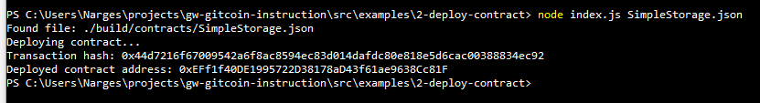

# Hackathon-Nervos - Task 2
Task Submission
1. A screenshot of the console output immediately after you have successfully deployed a smart contract.

2. The transaction hash from the contract deployment (in text format).

0x44d7216f67009542a6f8ac8594ec83d014dafdc80e818e5d6cac00388834ec92

3. The deployed contract address from the contract deployment (in text format).

0xEFf1f40DE1995722D38178aD43f61ae9638Cc81F

