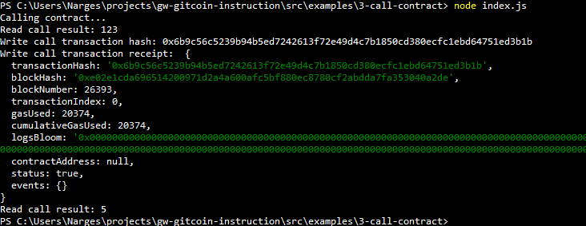

# Hackathon-Nervos - Task 3
Task Submission
1. A screenshot of the console output immediately after you have successfully issued a smart contract call.

2. The transaction hash from the console output (in text format).

0x6b9c56c5239b94b5ed7242613f72e49d4c7b1850cd380ecfc1ebd64751ed3b1b

3. The contract address that you called (in text format).

0xEFf1f40DE1995722D38178aD43f61ae9638Cc81F

4. The ABI for contract you made a call on (in text format).

[{
    "inputs": [],
    "stateMutability": "payable",
    "type": "constructor"
  },
  {
    "inputs": [
      {
        "internalType": "uint256",
        "name": "x",
        "type": "uint256"
      }
    ],
    "name": "set",
    "outputs": [],
    "stateMutability": "payable",
    "type": "function"
  },
  {
    "inputs": [],
    "name": "get",
    "outputs": [
      {
        "internalType": "uint256",
        "name": "",
        "type": "uint256"
      }
    ],
    "stateMutability": "view",
    "type": "function"
  }]

