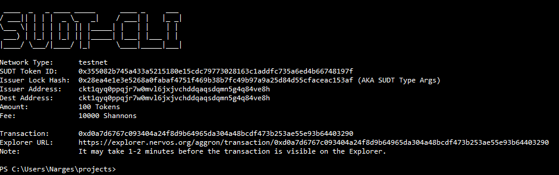
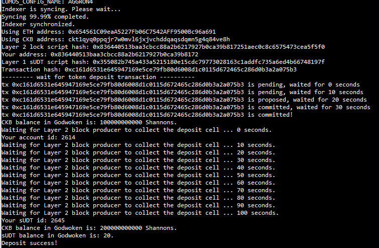

# Hackathon-Nervos - Task 4
Task Submission
1. A link to the Layer 1 address you funded on the Testnet Explorer.

https://explorer.nervos.org/aggron/address/ckt1qyq0ppqjr7w0mvl6jxjvchddqaqsdqmn5g4q84ve8h

2. A screenshot of the console output immediately after using sudt-cli to create your SUDT tokens on Layer 1.

3. A link to the transaction ID created by sudt-cli on the Testnet Explorer.

4. A screenshot of the console output immediately after you have successfully submitted a deposit to Layer 2 using the account-cli tool.

5. The SUDT ID from the console output after executing the deposit script (in text format).

2645

