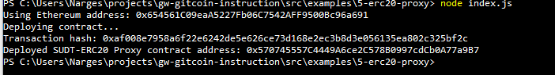
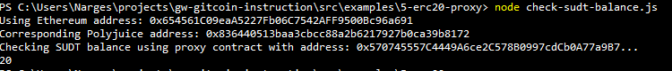

# Hackathon-Nervos - Task 5
Task Submission
1. A screenshot of the console output immediately after deploying smart contract.

2. The address of the ERC20 Proxy Contract you deployed (in text format).

0x570745557C4449A6ce2C578B0997cdCb0A77a9B7

3. A screenshot of the console output immediately after checking your SUDT balance.

4. The Ethereum address that was checked (in text format).

0x654561C09eaA5227Fb06C7542AFF9500Bc96a691

