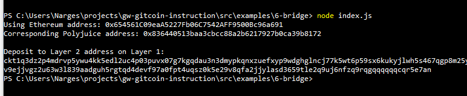

# Hackathon-Nervos - Task 6
Task Submission
1. A screenshot of the console output immediately after you have successfully generated your Deposit Receiver Address.

2. Your Deposit Receiver Address (in text format).

ckt1q3dz2p4mdrvp5ywu4kk5edl2uc4p03puvx07g7kgqdau3n3dmypkqnxzuefxyp9wdghglncj77k5wt6p59sx6kukyjlwh5s467qgp8m25yqqqqqsqqqqqvqqqqqfjqqqqpzlnlvh7mkhh4crc2dzh2r6xjw7l9etp9yz6wkzzkkewe86mkxtz6gqqqqpqqqqqqcqqqqqxyqqqqx7asf60w8pqpte2sfcfn90fdfzxue7ff2g8sawe9wacnqat6jmygqngqqqqpxv9ejjvgz2u63w3l839aadguh5rgtqd4devf97a0fpt4uqsz0k5e29v8qfa2jjylasd3659tle2q9uj6nfzq9rqgqqqqqqcqr5e7an

3. The Ethereum address used to generate the Deposit Receiver Address (in text format).

0x654561C09eaA5227Fb06C7542AFF9500Bc96a691

4. A link to the Etherscan explorer for the successful Force Bridge transaction. This can be found on Force Bridge under History→Succeed.

https://rinkeby.etherscan.io/tx/0xf4e020d4b8c317d676222f35a22be0fc88533d292cff823e90409d29cd3deda0

5. A link to the Nervos explorer for the successful Force bridge transaction. This can be found on Force Bridge under History→Succeed.

https://explorer.nervos.org/aggron/transaction/0x563a5bae76b6c08ec9b5355b4e28d4ebdbe6f085bee406b89a1eeecff4a2c7e0

