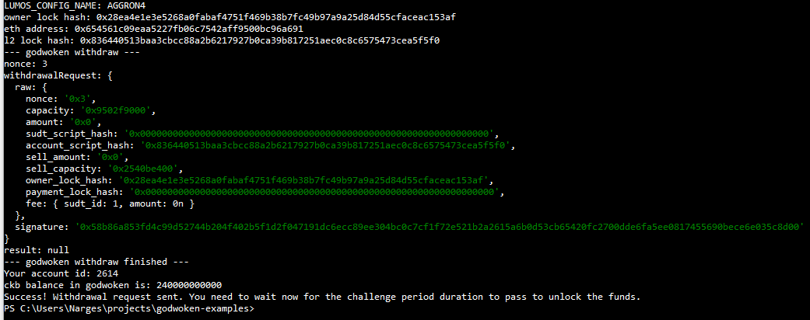

# Hackathon-Nervos - Task 9
Task Submission
1. A screenshot of the console output immediately after running the withdraw command.

2. The Ethereum address that you've used for your Layer 2 account (in text format).

0x654561C09eaA5227Fb06C7542AFF9500Bc96a691

3. The Nervos Layer 1 address that you passed to withdraw command (in text format).

ckt1qyq0ppqjr7w0mvl6jxjvchddqaqsdqmn5g4q84ve8h 

